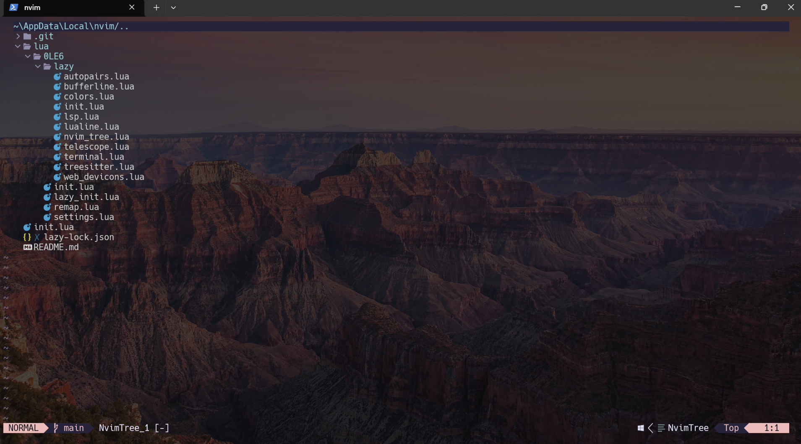
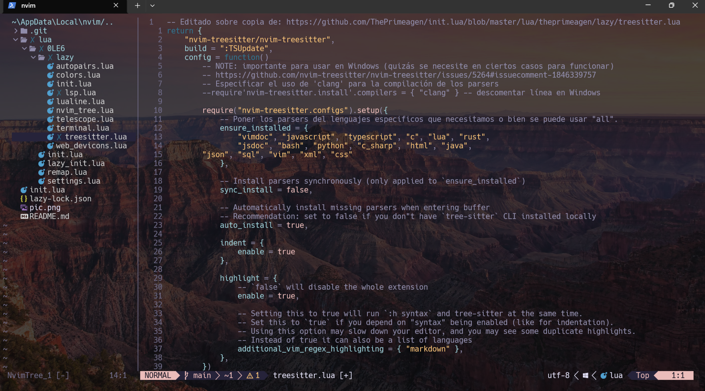
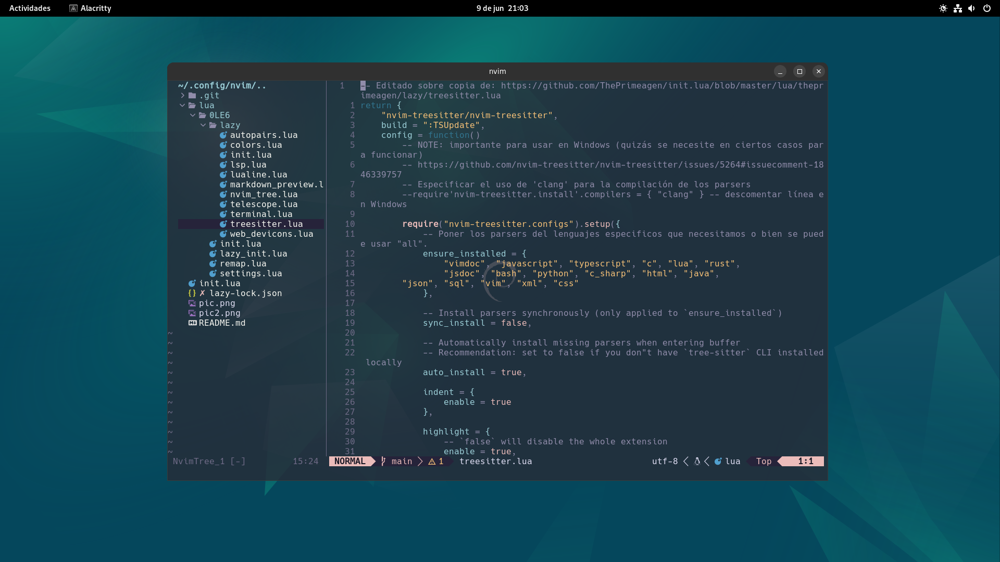

# First Neovim config from scratch

> [!WARNING]
> El contenido siguiente está en desarrollo activo y puede cambiar, no obstante es estable a día de hoy.

Update (12/09/24): añadido plugin neorg para tomar notas, requiere isntalar [luarocks](https://luarocks.org/)





## Config Windows
Para que funcione en Windows se ha de hacer lo siguiete:

Instalar __scoop__ como gestor de instalaciónd de paquetes desde este link https://scoop.sh/, copia el script de powershell que hay para su instalación y listo.

Tener instalado LLVM y GCC, emplear el gestor de paquetes scoop (no hace halta luego añadir al PATH, se hace automatico con Scoop)
````powershell
scoop install llvm

scoop install gcc
````

También hac falta la última versión de nodejs, instalamos con scoop también:

````powrshell
scoop install node
``````

Y por ultimo las herramientas de fd y ripgrep para temas de busquedas dentro de archivos:

`````powershell
scoop install ripgrep

scoop install fd
`````

> [!NOTE]
> quizás se me escape algún detalle más, lo añadiriá aquí como update.

## Config Linux o en su defecto WSL



Para que todo sea más sencillo y rapido, usar Homebrew como manejador de paquetes.

https://brew.sh/

```bash
# copia & pega para isntalar brew (extraído del enlace anterior)
/bin/bash -c "$(curl -fsSL https://raw.githubusercontent.com/Homebrew/install/HEAD/install.sh)"
```
```bash
# editamos con nano o vim el profile
nano ~/.profile

```
```bash
# añadimos la siguiente linea al final y guardamos
eval "$(/home/linuxbrew/.linuxbrew/bin/brew shellenv)"

```

Cuando lo tengamos, lo emplearemos para instalar Node, gcc, ripgrep...
Copiar, pegar y enter para que se ejecute el script de bash de instalación de herramientas que necesitaremos:

```bash
# Primero hacemos ejecutable nuestro script run_setup.sh
chmod +x run_setup.sh
./run_setup.sh
```

### Plugins

- [Telescope](https://github.com/nvim-telescope/telescope.nvim)
- [Language Protocol Service](https://github.com/neovim/nvim-lspconfig)
- [Tree](https://github.com/nvim-tree/nvim-tree.lua)
- [Treesitter](https://github.com/nvim-treesitter/nvim-treesitter)
- [Terminal](https://github.com/akinsho/toggleterm.nvim)
- [Comment](https://github.com/numToStr/Comment.nvim) 
- [Autopairs](https://github.com/windwp/nvim-autopairs)
- [Lualine](https://github.com/nvim-lualine/lualine.nvim)
- [Markdown Preview](https://github.com/iamcco/markdown-preview.nvim)
- [Web Devicons](https://github.com/nvim-tree/nvim-web-devicons)
- [Neorg](https://github.com/nvim-neorg/neorg)

